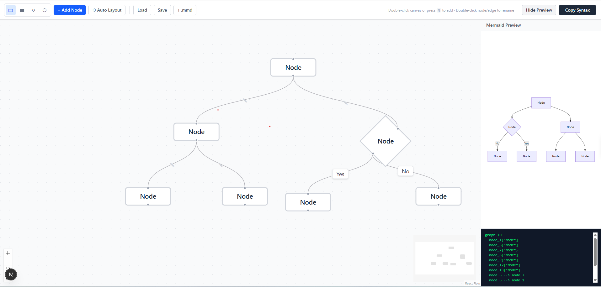

# Mermaid Visual Editor

A visual drag-and-drop editor for [Mermaid.js](https://mermaid.js.org) flowcharts. Build diagrams visually — export clean `.mmd` syntax.

No account. No cloud. Runs locally.

**[→ Try the live demo](https://mermaid-visual-editor-delta.vercel.app/)**



---

## Why

Writing Mermaid syntax by hand works fine for small diagrams. As diagrams grow, it becomes cognitively taxing — syntax errors, layout frustration, editing fatigue. This tool lets you **draw first, export syntax** rather than the other way around.

---

## Quick Start

```bash
git clone https://github.com/saketkattu/mermaid-visual-editor.git
cd mermaid-visual-editor
pnpm install
pnpm dev
```

Open [http://localhost:3000](http://localhost:3000).

**Requirements:** Node.js 18+, pnpm

---

## Features

### Drawing
- **Add nodes** — click `+ Add Node`, press `N`, or double-click the canvas
- **Connect nodes** — drag from the handle at the bottom of any node to another node
- **4 node shapes** — Rectangle `[ ]`, Rounded `( )`, Diamond `{ }`, Circle `(( ))`
- **Rename** — double-click any node or edge label to edit inline

### Editing
- **Shape picker** — select a node, then click a shape to change it
- **Delete** — select nodes/edges and press `Backspace` or `Delete`
- **Auto Layout** — click `⬡ Auto Layout` to arrange nodes top-to-bottom (powered by Dagre)

### Export & Save
- **Copy Syntax** — copies valid Mermaid `graph TD` syntax to clipboard
- **↓ .mmd** — downloads the diagram as a `.mmd` file
- **Save / Load** — save and reload the canvas as a `.json` file

### Preview
- **Show Preview** — live Mermaid.js render in a sidebar panel

---

## Keyboard Shortcuts

| Key | Action |
|-----|--------|
| `N` | Add a new node |
| `Backspace` / `Delete` | Delete selected node(s) or edge(s) |
| `Escape` | Deselect all |

---

## Roadmap

- [ ] Undo / Redo
- [ ] Import Mermaid syntax → canvas
- [ ] More diagram types (sequence, mindmap)
- [ ] Subgraph support
- [ ] Obsidian plugin

---

## Contributing

PRs welcome. Open an issue first for large changes.

```bash
pnpm dev     # development server
pnpm build   # production build
pnpm lint    # lint
```

---

## License

MIT © 2025
