# Mermaid Visual Editor — Diagramming Feature Research

> **Status:** Research document — not an implementation plan.
> **Purpose:** Catalogue the full possibility space of diagramming features that can be built,
> drawing from Mermaid.js capabilities, React Flow's feature set, and Excalidraw's UX philosophy.

---

## 1. Current MVP State

| Area | Details |
|------|---------|
| Diagram type | Flowchart only (`graph TD`) |
| Node shapes | 4 (rectangle, rounded, diamond, circle) |
| Edge types | 1 (solid arrow `-->`) |
| Layout | Dagre top-to-bottom |
| Export | `.mmd`, `.json`, clipboard |
| Import | `.json` only |
| Missing | Undo/redo, import Mermaid syntax, styling, other diagram types |

---

## 2. Mermaid.js — Full Capability Inventory

### 2.1 Supported Diagram Types (18)

| # | Type | Mermaid Keyword | Primary Use Case |
|---|------|----------------|-----------------|
| 1 | **Flowchart** | `flowchart` / `graph` | Processes, algorithms, decision trees |
| 2 | **Sequence Diagram** | `sequenceDiagram` | API flows, system interactions, UML |
| 3 | **Class Diagram** | `classDiagram` | OOP design, data models |
| 4 | **Entity Relationship** | `erDiagram` | Database schema design |
| 5 | **State Diagram** | `stateDiagram-v2` | State machines, behavior modeling |
| 6 | **Gantt Chart** | `gantt` | Project scheduling, timelines |
| 7 | **Mindmap** | `mindmap` | Brainstorming, hierarchical ideas |
| 8 | **Git Graph** | `gitgraph` | Commit history, branching strategy |
| 9 | **User Journey** | `journey` | UX flows, customer experience maps |
| 10 | **Timeline** | `timeline` | Chronological events, history |
| 11 | **Pie Chart** | `pie` | Proportional / percentage data |
| 12 | **C4 Diagram** | `C4Context` / `C4Container` | Software architecture (C4 model) |
| 13 | **Sankey Diagram** | `sankey-beta` | Flow quantities, resource flows |
| 14 | **XY Chart** | `xychart-beta` | Bar + line data charts |
| 15 | **Quadrant Chart** | `quadrantChart` | 2×2 prioritization matrices |
| 16 | **Block Diagram** | `block-beta` | System components, architecture |
| 17 | **Requirement Diagram** | `requirementDiagram` | Requirements traceability |
| 18 | **Kanban** | `kanban` | Workflow board visualization |

---

### 2.2 Flowchart Node Shapes (30+ in Mermaid v11)

The MVP has 4 shapes. Mermaid v11 introduced a new unified shape syntax and 30+ named shapes:

```
flowchart TD
  A[Rectangle]
  B(Rounded rect)
  C([Stadium / Pill])
  D[[Subroutine]]
  E[(Database / Cylinder)]
  F((Circle))
  G>Asymmetric]
  H{Diamond}
  I{{Hexagon}}
  J[/Parallelogram/]
  K[\Parallelogram alt\]
  L[/Trapezoid\]
  M[\Trapezoid alt/]
  N(((Double circle)))
```

**Named shape syntax (Mermaid v11):**
```
A@{ shape: circle, label: "My Circle" }
B@{ shape: delay, label: "Delay" }
C@{ shape: docs, label: "Multi-doc" }
D@{ shape: icon, icon: "fa:user" }
E@{ shape: image, imageHref: "url" }
```

**Shape categories:**

| Category | Shapes |
|----------|--------|
| Basic geometric | Rectangle, Rounded rectangle, Stadium/Pill, Circle, Double circle |
| Decision / Logic | Diamond, Hexagon |
| Process flow | Subroutine (double border), Preparation (hexagon), Delay (half-rect) |
| Data I/O | Parallelogram (input), Parallelogram alt (output), Trapezoid |
| Document | Document (wavy bottom), Multi-document |
| Storage | Database (cylinder), Stored data, Internal storage |
| Terminals | Junction (small circle), Connector |
| Special | Icon node (font icons), Image node (inline image), Arrow shape |

---

### 2.3 Edge / Link Types (12+)

| Type | Syntax | Description |
|------|--------|-------------|
| Arrow | `-->` | Solid line + filled arrowhead |
| Open / no arrow | `---` | Solid line, no arrowhead |
| Dotted arrow | `-.->` | Dashed line + arrowhead |
| Dotted no arrow | `-.-` | Dashed line, no arrowhead |
| Thick arrow | `==>` | Bold line + arrowhead |
| Thick no arrow | `===` | Bold line, no arrowhead |
| Bidirectional | `<-->` | Arrowhead on both ends |
| Circle end | `--o` | Line + circle terminus |
| Cross end | `--x` | Line + cross terminus |
| Invisible | `~~~` | Hidden edge (layout hint only) |
| Long edge | `---->` | Longer rank span (more dashes) |
| Multi-directional | `o--o`, `x--x`, `<-->` | Mixed end styles |

---

### 2.4 Edge Curve Styles (12 d3-shape curves)

Configurable at diagram level via `%%{ init: { "flowchart": { "curve": "..." } } }%%`:

`basis` · `bumpX` · `bumpY` · `cardinal` · `catmullRom` · `linear` ·
`monotoneX` · `monotoneY` · `natural` · `step` · `stepAfter` · `stepBefore`

---

### 2.5 Subgraphs / Groups

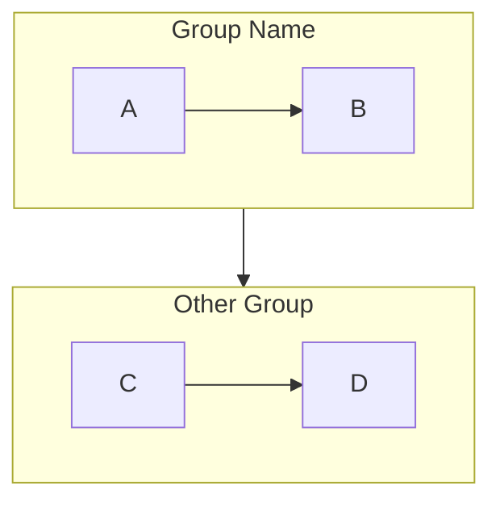

**Capabilities:**
- Named subgraphs with explicit IDs
- Edges to/from subgraphs (not just nodes)
- Per-subgraph `direction` (can differ from parent)
- Nested subgraphs (subgraph within subgraph)
- Subgraph-level styling

---

### 2.6 Styling System

**Per-node style:**
```
style nodeId fill:#ff9,stroke:#333,stroke-width:4px
```

**Reusable CSS classes (classDef):**
```
classDef primary fill:#4a90e2,stroke:#2c5282,color:#fff
class nodeA,nodeB primary
```

**Per-edge style (by order index):**
```
linkStyle 0 stroke:#ff3,stroke-width:4px
linkStyle default stroke:#666
```

---

### 2.7 Themes & Visual Looks

**Built-in themes:**
- `default` — Light background, blue accent
- `dark` — Dark background, light text
- `forest` — Green tones
- `base` — Minimal, customizable
- `neutral` — Gray, professional

**Look options (Mermaid v11+):**
- `classic` — Standard rendering
- `handDrawn` — Rough.js sketch aesthetic

**Custom theme variables:**
```javascript
%%{
  init: {
    "theme": "base",
    "themeVariables": {
      "primaryColor": "#4a90e2",
      "primaryBorderColor": "#2c5282",
      "primaryTextColor": "#1a202c",
      "lineColor": "#718096",
      "background": "#f7fafc"
    }
  }
}%%
```

---

### 2.8 Layout Engines

| Engine | Config | Best For |
|--------|--------|----------|
| **Dagre** (default) | `layout: dagre` | Hierarchical / layered graphs |
| **ELK** | `layout: elk` | Large graphs, complex layouts |

**ELK node placement strategies:**
- `SIMPLE` · `INTERACTIVE` · `LINEAR_SEGMENTS` · `BRANDES_KOEPF` ·
  `NETWORK_SIMPLEX` · `BARYCENTRICALIGN`

**Graph directions:** `TD` (top-down) · `LR` (left-right) · `BT` (bottom-top) · `RL` (right-left)

---

### 2.9 Sequence Diagram — Full Feature Set

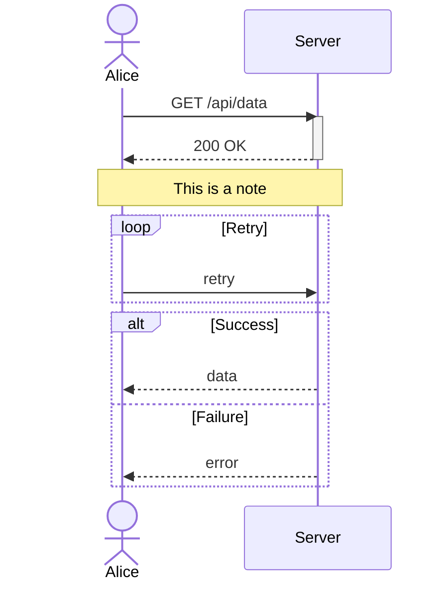

| Feature | Description |
|---------|-------------|
| Actors | `actor` keyword (person icon) |
| Participants | `participant` keyword (box icon) |
| Message types | Solid (`->`), dashed (`-->`), solid+arrow (`->>`), dashed+arrow (`-->>`), cross (destroyed `-x`), async arrow (`-)`) |
| Activation boxes | `activate` / `deactivate` or `+`/`-` shorthand |
| Notes | `Note left of`, `Note right of`, `Note over A,B` |
| Loops | `loop ... end` |
| Alt/Opt/Par | `alt ... else ... end`, `opt ... end`, `par ... and ... end` |
| Critical/Break | `critical ... end`, `break ... end` |
| Autonumbering | `autonumber` |
| Grouping (Box) | `box Color Title ... end` |
| Create/Destroy | `create participant`, `destroy participant` |
| Background rect | `rect rgba(...)` highlight regions |
| Links | Clickable participant hyperlinks |

---

### 2.10 Class Diagram — Full Feature Set

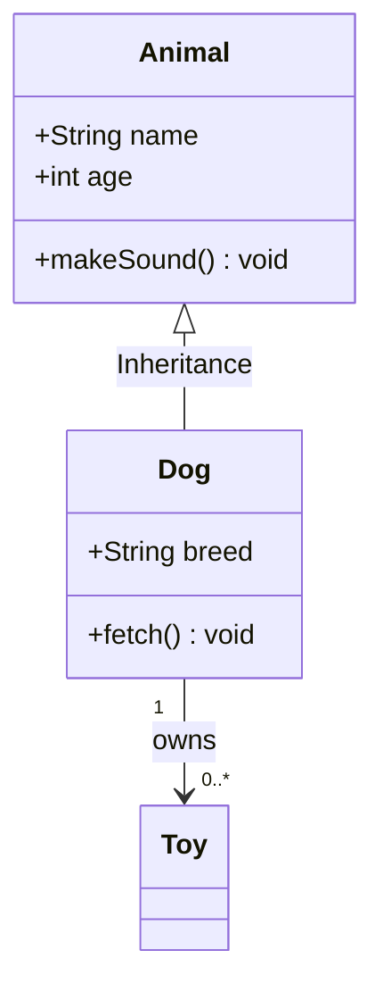

| Feature | Description |
|---------|-------------|
| Classes | With typed attributes and methods |
| Visibility | `+` public, `-` private, `#` protected, `~` package |
| Return types | Method return type annotation |
| Abstract | `*` abstract indicator |
| Static | `$` static indicator |
| Generics | `List~T~` generic type syntax |
| Relationships | Inheritance (`<\|--`), composition (`*--`), aggregation (`o--`), association (`-->`), dependency (`..>`), realization (`<\|..`) |
| Multiplicity | `"1"`, `"0..*"`, `"1..*"` on relationship ends |
| Labels | Relationship label text |
| Notes | `note for ClassName "text"` |
| Namespaces | `namespace NS { ... }` grouping |
| Links | Clickable class hyperlinks |
| Direction | TD / BT / LR / RL |

---

### 2.11 ER Diagram — Full Feature Set

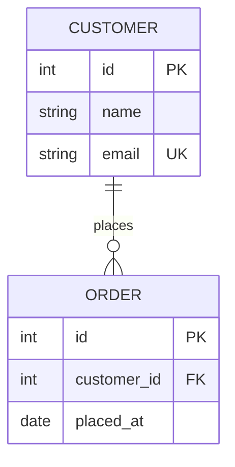

| Feature | Description |
|---------|-------------|
| Entities | Table-like boxes with typed attributes |
| Attribute types | `int`, `string`, `boolean`, `date`, `float`, etc. |
| Keys | `PK` (primary), `FK` (foreign), `UK` (unique) |
| Relationships | Full ERD crow's foot notation |
| Cardinality | `\|\|` (one), `o\|` (zero-or-one), `\|{` (one-or-many), `o{` (zero-or-many) |
| Relationship labels | Text on connection line |
| Non-identifying | Dashed line for non-identifying relationships |

---

### 2.12 State Diagram — Full Feature Set

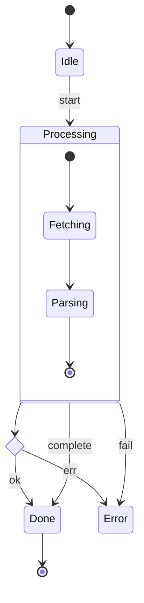

| Feature | Description |
|---------|-------------|
| States | Named states, start (`[*]`), end (`[*]`) |
| Transitions | With optional label text |
| Composite states | Nested state machines |
| Concurrency | `--` horizontal divider for parallel regions |
| Fork / Join | Special fork and join states |
| Choice | `<<choice>>` conditional state |
| Note | `note left/right of State` |
| Direction | `direction LR / TB` |
| Styling | Per-state `classDef` styling |

---

### 2.13 Gantt Chart — Full Feature Set

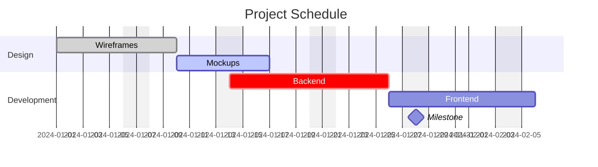

| Feature | Description |
|---------|-------------|
| Sections | Task groupings with header labels |
| Tasks | With optional ID, status, start date, duration |
| Dependencies | `after taskId` for task chaining |
| Date formats | Configurable via `dateFormat` directive |
| Task states | `active`, `done`, `crit` (critical), `milestone` |
| Milestones | Zero-duration point-in-time markers |
| Vertical markers | `vert` date markers for key dates |
| Exclusions | `excludes weekends`, specific dates |
| Display format | `axisFormat` for tick label formatting |
| Week start | `weekday monday` to set week start |

---

### 2.14 Mindmap — Full Feature Set

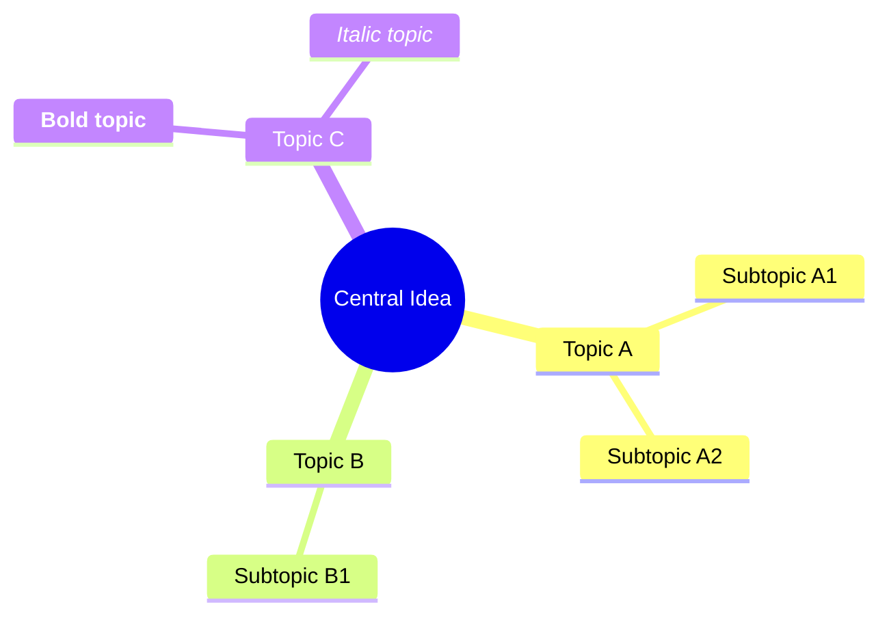

| Feature | Description |
|---------|-------------|
| Hierarchy | Indentation-based depth levels |
| Root shape | `(())` double circle |
| Node shapes | `[]` square, `()` rounded, `(())` circle, `))` bang, `)` cloud, `{{}}` hexagon |
| Icons | `::icon(fa fa-name)` font icon per node |
| Markdown text | Bold (`**`), italic (`*`), auto-wrap |
| Depth colors | Auto-colored by depth level |

---

### 2.15 Git Graph — Full Feature Set

```mermaid
gitgraph LR:
  commit id: "init"
  branch feature
  checkout feature
  commit id: "feature work"
  commit id: "more work"
  checkout main
  merge feature id: "merge" tag: "v1.0"
  commit id: "hotfix"
```

| Feature | Description |
|---------|-------------|
| Commits | With optional ID, message, tag |
| Branches | Create, checkout, switch |
| Merges | Merge with optional ID and tag |
| Cherry-pick | `cherry-pick id: "..."` |
| Orientation | `LR` (left-right) or `TB` (top-bottom) |
| Parallel commits | Multiple commits on same branch |
| Custom commit types | `HIGHLIGHT`, `REVERSE`, `NORMAL` |
| Themes | Branch colors follow theme |

---

### 2.16 User Journey — Features

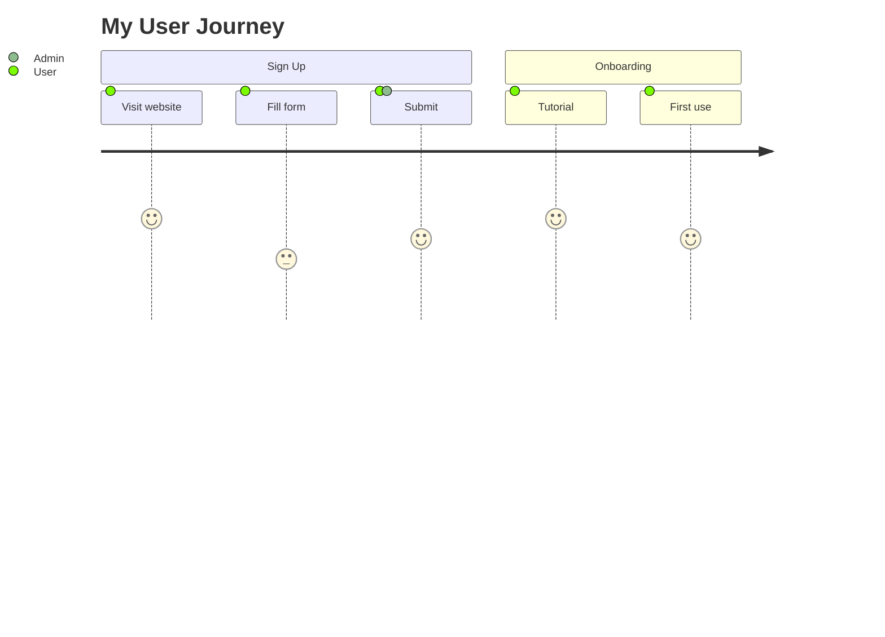

| Feature | Description |
|---------|-------------|
| Sections | Phase/stage groupings |
| Steps/Tasks | Step name + satisfaction score (1-5) + actors |
| Multiple actors | Steps can involve multiple named actors |
| Score visualization | Score displayed as colored cell |
| Actor labels | Actor names shown on y-axis |

---

### 2.17 Timeline — Features

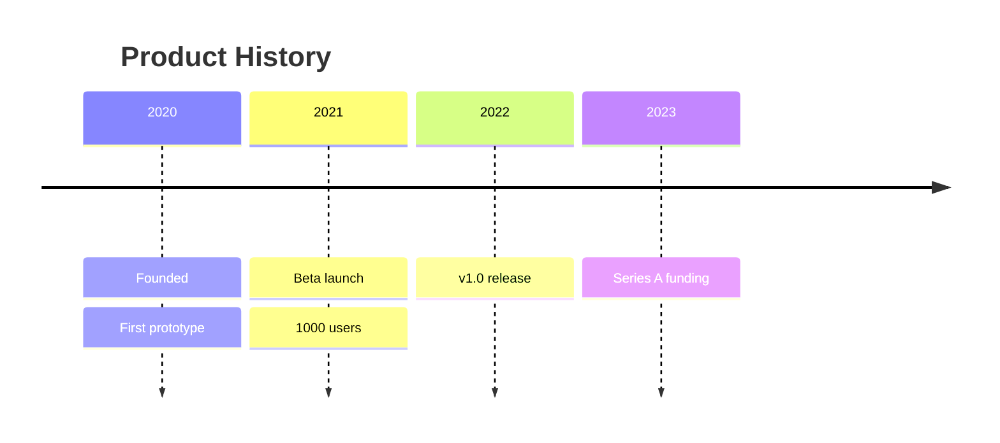

| Feature | Description |
|---------|-------------|
| Periods | Time sections (years, quarters, etc.) |
| Events | Multiple events per period |
| Title | Diagram title |
| Sections | Visual grouping with color coding |
| `disableMulticolor` | Single-color mode |

---

### 2.18 Block Diagram — Features

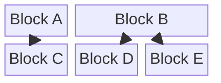

| Feature | Description |
|---------|-------------|
| Column layout | Fixed column grid |
| Block sizes | Span multiple columns with `:N` |
| Composite blocks | `block ... end` nested groups |
| Space | Empty cells with `space` |
| Connections | Arrow edges between blocks |
| Styling | `style` and `classDef` support |

---

### 2.19 C4 Architecture Diagrams — Features

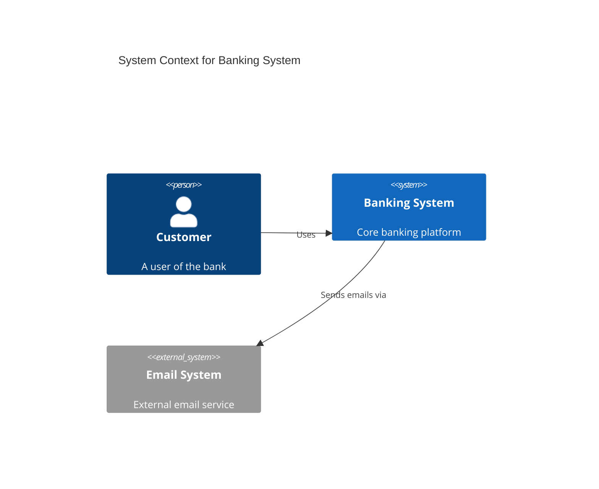

**C4 diagram levels:**
- `C4Context` — System context (persons, systems)
- `C4Container` — Container level (apps, databases, APIs)
- `C4Component` — Component level (modules within a container)
- `C4Dynamic` — Runtime interaction flows
- `C4Deployment` — Deployment architecture

| Feature | Description |
|---------|-------------|
| Element types | `Person`, `System`, `Container`, `Component`, `Boundary`, `Enterprise_Boundary`, `System_Boundary` |
| Relationships | `Rel`, `Rel_Back`, `Rel_Neighbor`, `Rel_Up`, `Rel_Down`, `Rel_Left`, `Rel_Right` |
| External elements | `System_Ext`, `Container_Ext`, etc. |
| Tags | `$tags`, `$link` for metadata |
| Labels | Technology label, description |
| Boundaries | Scoping groups (system, enterprise, container) |

---

### 2.20 Quadrant Chart — Features

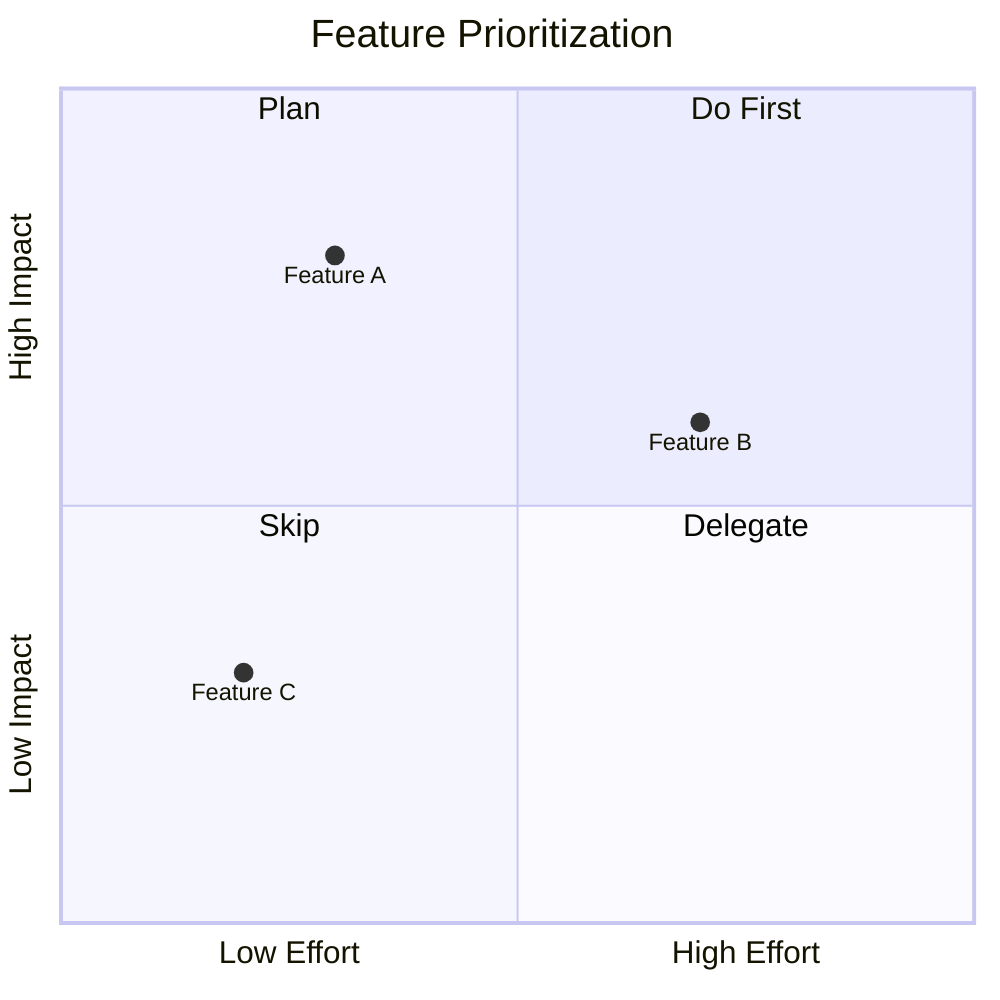

| Feature | Description |
|---------|-------------|
| Axes | Custom min/max labels for X and Y |
| Quadrant labels | Custom label per quadrant |
| Data points | Named items with `[x, y]` coordinates |
| Point styling | Via `classDef` |

---

### 2.21 Pie Chart — Features

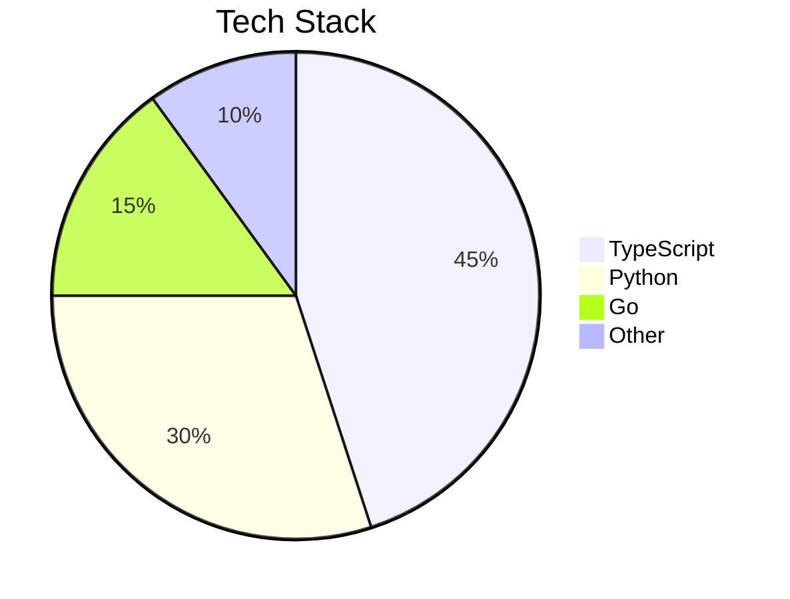

| Feature | Description |
|---------|-------------|
| Slices | Named segments with numeric values |
| Auto-percentage | Automatic % calculation |
| Title | Chart title |
| `showData` | Display raw values instead of % |
| Colors | Follow theme |

---

### 2.22 XY Chart — Features

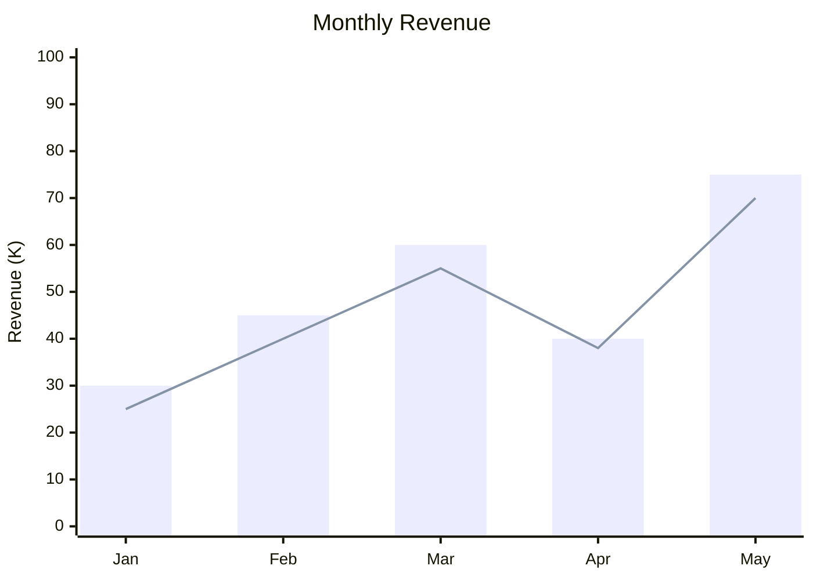

| Feature | Description |
|---------|-------------|
| Bar chart | Vertical bars |
| Line chart | Line series |
| Combined | Bar + line on same chart |
| Custom axes | Labels, range, title |
| Horizontal | `xychart-beta horizontal` |

---

### 2.23 Sankey Diagram — Features

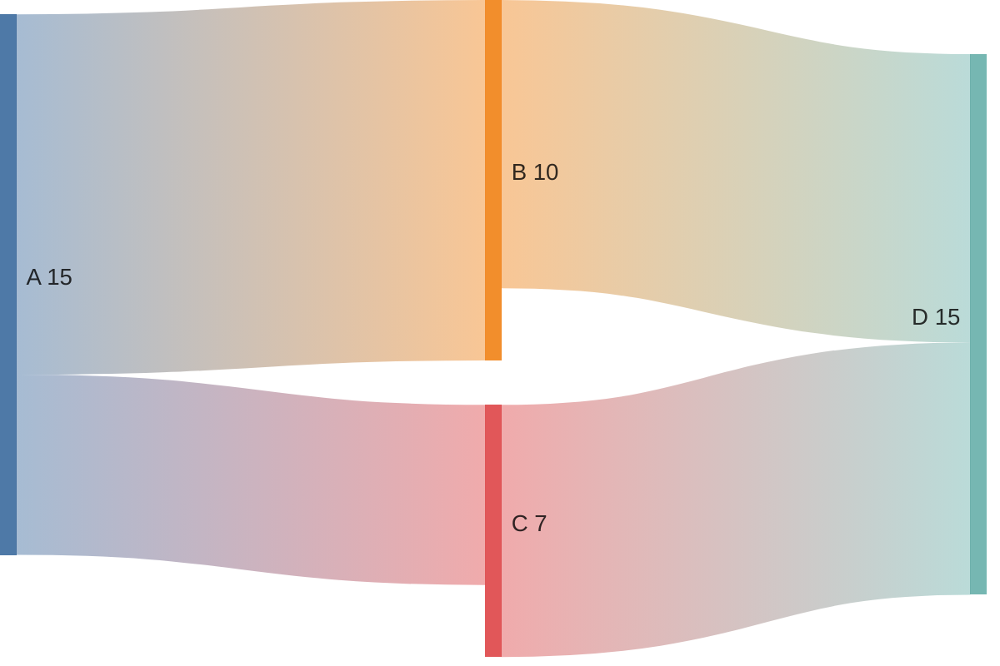

| Feature | Description |
|---------|-------------|
| Source/target pairs | CSV-style `source,target,value` |
| Flow widths | Proportional to value |
| Color coding | Source-colored links |
| Prefix | `%%{init: {...}}%%` configuration |

---

### 2.24 Requirement Diagram — Features

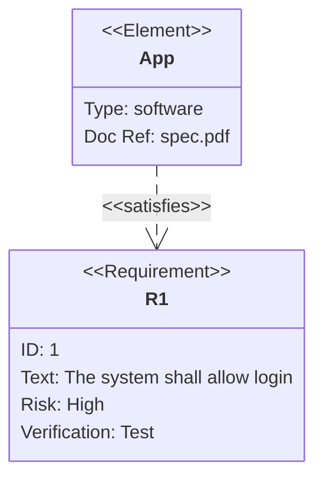

| Feature | Description |
|---------|-------------|
| Requirements | Named with id, text, risk, verifymethod |
| Elements | Software/hardware components |
| Relationships | satisfies, traces, refines, contains, copies, derives |
| Risk levels | `low`, `medium`, `high` |
| Verify methods | `analysis`, `demonstration`, `inspection`, `test` |

---

### 2.25 Kanban — Features

```mermaid
kanban
  Todo
    task1["Fix bug #123"]
    task2["Write docs"]
  In Progress
    task3["Build feature X"]::active
  Done
    task4["Deploy v1.0"]::done
```

| Feature | Description |
|---------|-------------|
| Columns | Workflow stage columns |
| Cards | Task cards with labels |
| Status | `::active`, `::done` visual states |
| Ticket IDs | Optional ID metadata |
| Assignments | `@assignee` notation |

---

### 2.26 Interactive Features (all diagram types)

| Feature | Description |
|---------|-------------|
| Click events | `click nodeId callback "tooltip"` |
| Hyperlinks | `click nodeId href "url" "tooltip"` |
| Tooltips | On-hover tooltip text |
| Security levels | `loose` enables clicks, `strict` disables |

---

### 2.27 Markdown Label Enhancements

Available in flowcharts and mindmaps:
```
A["`**Bold** and *italic* text
    Wraps automatically`"]
```

- Bold: `**text**`
- Italic: `*text*`
- Auto line-wrap (no `<br>` needed)
- Multi-line text with newlines

---

## 3. React Flow — Full Capability Inventory

### 3.1 Node Capabilities

| Feature | API | Description |
|---------|-----|-------------|
| Custom node types | `nodeTypes` prop | Full React component as node |
| Node resizer | `<NodeResizer />` | Drag-handle resize |
| Node toolbar | `<NodeToolbar />` | Contextual floating toolbar |
| Drag handle | `dragHandle` prop | Restrict drag to specific zone |
| Groups / subflows | `parentId` prop | Nest nodes inside container |
| Collapsible | Custom state | Expand/collapse sub-trees |
| Annotation nodes | Custom type | Non-connected labels |
| Rotatable nodes | CSS `transform` | Angle rotation |
| Icon nodes | Custom type | Icon-only compact nodes |

### 3.2 Edge Capabilities

| Feature | API | Description |
|---------|-----|-------------|
| Built-in edge types | `type` prop | `default` (bezier), `smoothstep`, `step`, `straight` |
| Custom edge paths | Custom edge component | Any SVG path |
| Edge labels | `label` prop | Inline text |
| Edge label renderer | `<EdgeLabelRenderer />` | DOM-layer label (HTML) |
| Floating edges | Custom | Connect to nearest point |
| Animated edges | `animated` prop | Dashed stroke animation |
| Edge toolbar | Custom | Floating actions on edge select |
| Bidirectional | Custom | Two-way arrows |
| Self-loop | Custom | Node → itself edge |
| Control points | Pro feature | Draggable bezier handles |
| Multiple handles | `<Handle />` | Any number of in/out ports |
| Handle labels | Custom | Labels on connection ports |
| Conditional handles | Custom state | Show/hide ports dynamically |

### 3.3 Canvas Interactions

| Feature | Implementation | Description |
|---------|---------------|-------------|
| Box select | Native | Shift+drag to select region |
| Ctrl+click | Native | Multi-select via click |
| Zoom | Native | Scroll wheel / pinch |
| Pan | Native | Click+drag canvas |
| Minimap | `<MiniMap />` | Overview panel |
| Controls | `<Controls />` | Zoom UI buttons |
| Background patterns | `<Background />` | Dots, lines, cross, blank |
| Context menu | Custom `onContextMenu` | Right-click actions |
| Drag and drop | `onDrop`/`onDragOver` | Drop from sidebar |
| Snap to grid | `snapToGrid`, `snapGrid` | Position snapping |
| Keyboard shortcuts | `deleteKeyCode`, custom | Fully configurable |
| Touch / mobile | Native | Pinch zoom, tap |

### 3.4 Layout Algorithms (compatible with React Flow)

| Algorithm | Package | Best For |
|-----------|---------|----------|
| **Dagre** | `@dagrejs/dagre` | Hierarchical (current) |
| **ELK** | `elkjs` | Large/complex, force-directed |
| **D3-Force** | `d3-force` | Network, organic layouts |
| **D3-DAG** | `d3-dag` | Specialized DAG layouts |
| **Cola.js** | `webcola` | Constraint-based |
| **Auto** | Custom | Mix of algorithms per type |

### 3.5 Data & Persistence

| Feature | Description |
|---------|-------------|
| Save / restore | JSON snapshot of full canvas |
| Undo / redo | History stack (past/future state arrays) |
| Import | Restore from JSON |
| Serialize | `getNodes()`, `getEdges()` hooks |

### 3.6 Advanced / Pro Features

| Feature | Description |
|---------|-------------|
| Real-time collaboration | Yjs CRDT multi-user sync |
| Cursor presence | See other users' cursors |
| Drag control points | Movable bezier curve handles |
| Node auto-layout | Trigger re-layout on demand |
| AI node generation | Prompt → node placement |

---

## 4. Excalidraw-Inspired Features (UX Philosophy)

> Excalidraw's philosophy: **"Expressive, fast, low-friction diagramming."**
> We draw inspiration purely from features, not visual style.

### 4.1 Drawing Primitives

| Feature | Excalidraw Tool | How to Build |
|---------|----------------|--------------|
| Floating text | Text tool | Annotation/label node type |
| Sticky notes | Note shape | Colored note node type |
| Images | Image tool | Image embed node |
| Icons | Icon picker | Icon node with Lucide/FA |
| Freehand path | Pen tool | SVG path node type |
| Frame/section | Frame tool | Container group node |
| Arrow (free) | Arrow tool | Floating edge type |

### 4.2 Styling Controls

| Feature | Description |
|---------|-------------|
| Stroke color | Per-node/edge color picker |
| Fill color | Node background picker |
| Stroke width | Thin / normal / thick |
| Stroke style | Solid / dashed / dotted |
| Fill style | Solid / hatched / none |
| Opacity | Per-element transparency |
| Corner radius | Node rounded corners |
| Font family | Per-node font picker |
| Font size | Per-node text size |
| Text alignment | Left / center / right |
| Hand-drawn roughness | Roughness level 0–3 |

### 4.3 Object Manipulation

| Feature | Shortcut | Description |
|---------|----------|-------------|
| Copy / paste | Ctrl+C / Ctrl+V | Duplicate to clipboard |
| Duplicate | Ctrl+D | Clone with offset |
| Group | Ctrl+G | Treat as single unit |
| Ungroup | Ctrl+Shift+G | Break group apart |
| Lock element | — | Prevent accidental edits |
| Align left/right/center | Toolbar | Horizontal alignment |
| Align top/bottom/middle | Toolbar | Vertical alignment |
| Distribute horizontal | Toolbar | Even horizontal spacing |
| Distribute vertical | Toolbar | Even vertical spacing |
| Bring to front | Ctrl+Shift+↑ | Z-order: top |
| Send to back | Ctrl+Shift+↓ | Z-order: bottom |
| Flip horizontal | — | Mirror X axis |
| Flip vertical | — | Mirror Y axis |
| Rotate | Handle | Free rotation |
| Resize locked | Shift+drag | Maintain aspect ratio |

### 4.4 Canvas Experience

| Feature | Description |
|---------|-------------|
| Infinite canvas | Unbounded scroll space |
| Dark mode | Full UI theme switch |
| Zoom to fit | Fit all content in viewport |
| Zoom to selection | Fit selected elements |
| Grid with snap | Optional snapping grid |
| Smart guides | Alignment hints while dragging |
| Pan via Space+drag | Alternative pan method |
| Minimap click-nav | Click minimap to navigate |

### 4.5 Templates & Library System

| Feature | Description |
|---------|-------------|
| Diagram templates | Pre-built starter diagrams per type |
| Shape library | Categorized reusable elements |
| User-saved shapes | Personal saved element sets |
| Search shapes | Filter library by name |
| Import to canvas | Drag from library to canvas |

### 4.6 Export & Sharing

| Feature | Description |
|---------|-------------|
| Export PNG | Rasterized image |
| Export SVG | Scalable vector |
| Export PDF | Print-ready (via browser) |
| Shareable URL | URL-encoded diagram state |
| Embeddable viewer | Read-only iframe embed |
| Copy as image | Clipboard image copy |

### 4.7 Collaboration

| Feature | Description |
|---------|-------------|
| Real-time co-editing | Yjs-based multi-user |
| Cursor presence | Named cursors per user |
| Comment annotations | Node-attached text threads |
| Version history | Named snapshots |

---

## 5. Complete Feature List — All Buildable Features

### Category A: Flowchart Enhancements

| ID | Feature | What Changes | Complexity |
|----|---------|-------------|------------|
| A1 | **More node shapes** (hexagon, cylinder, parallelogram, trapezoid, subroutine, document, stadium, double-circle) | Expand shape picker 4 → 12+ | Low |
| A2 | **Edge type picker** (solid/dashed/thick, arrowhead variants, bidirectional, circle-end, cross-end) | New edge type options | Low |
| A3 | **Flowchart direction** (TD / LR / BT / RL) | Direction selector in toolbar | Low |
| A4 | **Undo / redo** (Ctrl+Z / Ctrl+Shift+Z) | History stack in Zustand | Medium |
| A5 | **Import Mermaid syntax → canvas** | Mermaid parser → canvas model | Medium |
| A6 | **Subgraphs / container groups** | Parent-child nodes in React Flow | Medium |
| A7 | **Node custom color** (fill + stroke + text color) | Color picker, serialize to `classDef` | Medium |
| A8 | **Edge custom color** (stroke color, width) | Color picker, serialize to `linkStyle` | Low |
| A9 | **Edge curve style selector** (step / straight / smooth / etc.) | Diagram-level curve config | Low |
| A10 | **Node toolbar** (quick: delete, shape, duplicate, color) | React Flow `<NodeToolbar />` | Low |
| A11 | **Node resize** (free-form resize for notes/containers) | React Flow `<NodeResizer />` | Low |
| A12 | **Context menu** (right-click on node / edge / canvas) | Custom `onContextMenu` handler | Medium |
| A13 | **Drag-and-drop from sidebar palette** | Sidebar + `onDrop` handler | Medium |
| A14 | **Snap to grid** | `snapToGrid` + toggle | Low |
| A15 | **Alignment tools** (align L/C/R/top/mid/bottom + distribute) | Custom alignment calculations | Medium |
| A16 | **Copy / paste** (Ctrl+C / Ctrl+V nodes+edges) | Clipboard with offset positioning | Medium |
| A17 | **Duplicate** (Ctrl+D) | Clone selected with offset | Low |
| A18 | **Multi-handle nodes** (custom in/out ports, port labels) | Custom `<Handle />` per port | Medium |
| A19 | **Floating edges** (connect to nearest point) | Floating edge component | Low |
| A20 | **Self-loop edges** | Custom self-connecting edge | Low |
| A21 | **ELK layout engine** + strategy selector | `elkjs` integration | Medium |
| A22 | **Layout direction auto-suggest** | Heuristic based on node count | Low |
| A23 | **Mermaid theme picker** (default/dark/forest/neutral) | `mermaid.initialize({ theme })` | Low |
| A24 | **Hand-drawn look toggle** | `look: handDrawn` config | Low |
| A25 | **Zoom to selection** | `fitView` with node filter | Low |
| A26 | **Lock/unlock nodes** | `draggable: false` + `selectable: false` | Low |
| A27 | **Markdown labels** (bold, italic in node/edge text) | Mermaid backtick string syntax | Low |
| A28 | **Clickable nodes** (link to URL on click) | `click` binding in serializer | Low |
| A29 | **Tooltip on hover** | Node `title` attribute + mermaid tooltip | Low |
| A30 | **Icon nodes** (font-awesome or Lucide icon inside node) | `@{ icon: "..." }` shape, custom React node | Medium |

---

### Category B: New Diagram Types

| ID | Diagram | Key Elements to Build | Complexity |
|----|---------|-----------------------|------------|
| B1 | **Sequence Diagram** | Actor/Participant nodes, Message edges, Alt/Loop/Par blocks, Activation boxes, Notes | High |
| B2 | **Class Diagram** | Class nodes (attrs + methods), 6 relationship edge types, Multiplicity labels, Namespaces | High |
| B3 | **State Diagram** | State nodes, Transition edges, Composite states, Fork/Join, Choice nodes | High |
| B4 | **ER Diagram** | Entity nodes (with attribute rows), Cardinality edges, PK/FK indicators | High |
| B5 | **Mindmap** | Root + hierarchy nodes, 6 node shapes, icon support, drag to restructure | Medium |
| B6 | **Gantt Chart** | Section headers, Task bars (dates/duration), Milestone markers, Dependency arrows | Medium |
| B7 | **User Journey** | Section headers, Step nodes (name + score + actors), Actor tracks | Medium |
| B8 | **Timeline** | Period labels, Event entries, Visual color sections | Low |
| B9 | **Git Graph** | Commit nodes, Branch lines, Merge arrows, Cherry-pick, Tag labels | Medium |
| B10 | **C4 Architecture** | Person/System/Container/Component nodes, 5 boundary types, Relationship edges | High |
| B11 | **Quadrant Chart** | 4-quadrant canvas, Axis labels, Plotted data points | Low |
| B12 | **Pie Chart** | Slice segments, Value input, Auto-% | Low |
| B13 | **XY Chart** | Axis config, Bar series, Line series | Medium |
| B14 | **Sankey Diagram** | Flow nodes, Proportional edge widths | Medium |
| B15 | **Block Diagram** | Column grid, Spanning blocks, Composite blocks | Medium |
| B16 | **Kanban Board** | Column containers, Card nodes, Status badges | Medium |
| B17 | **Requirement Diagram** | Requirement nodes, Element nodes, 6 relationship types | High |

---

### Category C: Canvas & UX Enhancements

| ID | Feature | Complexity |
|----|---------|------------|
| C1 | **Annotation / floating text** node | Low |
| C2 | **Sticky note** node (colored) | Low |
| C3 | **Image embed** node (URL / upload) | Medium |
| C4 | **Icon node** (inline icon picker) | Medium |
| C5 | **Frame / section** container | Medium |
| C6 | **Freehand drawing** tool (pen path) | High |
| C7 | **Dark mode** canvas + UI | Low |
| C8 | **Background style toggle** (dots / lines / cross / blank) | Low |
| C9 | **Global typography settings** (font family, size) | Low |
| C10 | **Presentation mode** (fullscreen, step-through) | Medium |
| C11 | **Multi-diagram workspace** (tabs per diagram) | High |
| C12 | **Z-order / layers panel** | High |
| C13 | **Keyboard shortcut reference panel** | Low |

---

### Category D: Export, Sharing & Collaboration

| ID | Feature | Complexity |
|----|---------|------------|
| D1 | **Export PNG** | Low |
| D2 | **Export SVG** | Low |
| D3 | **Shareable link** (URL-encoded state) | Medium |
| D4 | **Embeddable read-only viewer** | Medium |
| D5 | **Real-time collaboration** (Yjs) | Very High |
| D6 | **Comment / annotation threads** on nodes | Medium |
| D7 | **Diagram version history** | High |
| D8 | **Import from draw.io / Lucidchart** | Very High |

---

### Category E: Templates & Library

| ID | Feature | Complexity |
|----|---------|------------|
| E1 | **Diagram templates** per type (starter examples) | Low |
| E2 | **Shape library panel** (drag-drop from catalogue) | Medium |
| E3 | **User-saved element library** | High |
| E4 | **Template gallery** (community-sourced) | Very High |

---

### Category F: AI & Smart Features

| ID | Feature | Complexity |
|----|---------|------------|
| F1 | **AI text → diagram** (prompt → Mermaid code) | Medium |
| F2 | **AI diagram editing** (chat to modify) | High |
| F3 | **Proximity auto-connect** (snap + auto-edge) | Medium |
| F4 | **Smart layout suggestions** | High |
| F5 | **Import Mermaid** (parse syntax → canvas) | Medium |

---

### Category G: Developer & Power Features

| ID | Feature | Complexity |
|----|---------|------------|
| G1 | **Live Mermaid code editor** panel (one-way preview) | Medium |
| G2 | **Two-way code ↔ canvas sync** | Very High |
| G3 | **Obsidian plugin** | Medium |
| G4 | **VS Code extension** | High |
| G5 | **Embeddable widget / API** | High |
| G6 | **CLI diagram generation** | Medium |
| G7 | **Keyboard-only navigation** | High |

---

## 6. Prioritization Reference

```
╔════════════════════╦══════════════════════════════════════════════════════╗
║   QUICK WINS       ║  A1 A2 A3 A4 A9 A10 A11 A17 A23 A24 A25            ║
║ (Low complexity,   ║  C1 C2 C7 C8 C13 D1 D2 E1 B8 B11 B12               ║
║  high value)       ║                                                      ║
╠════════════════════╬══════════════════════════════════════════════════════╣
║  MEDIUM EFFORT,    ║  A5 A6 A7 A12 A13 A16 A21                           ║
║  HIGH VALUE        ║  B5 B6 B7 B9 D3 G1 F1                               ║
╠════════════════════╬══════════════════════════════════════════════════════╣
║  MAJOR FEATURES    ║  B1 B2 B3 B4 B10                                    ║
║  (High effort,     ║  C11 D5 G2                                           ║
║  high value)       ║                                                      ║
╠════════════════════╬══════════════════════════════════════════════════════╣
║  MOONSHOTS         ║  D5 D8 E4 F2 G4 G5                                  ║
║  (Very high,       ║                                                      ║
║  transformative)   ║                                                      ║
╚════════════════════╩══════════════════════════════════════════════════════╝
```

---

## 7. Technical Architecture Implications

### For each new diagram type:
1. **New serializer** — `lib/serializers/[type]Serializer.ts` — converts canvas state → Mermaid syntax
2. **New node types** — `components/NodeTypes/[type]/` — React components per diagram's elements
3. **New edge types** — custom edge components for diagram-specific connections
4. **Layout logic** — some diagram types are purely code-generated (Gantt, Git, Pie, etc.)
5. **Diagram-type toolbar** — context-sensitive tools per active diagram type
6. **Zustand store** — extend with `diagramType` state and per-type data model

### For undo/redo (A4):
```typescript
// Zustand middleware pattern
interface HistoryState {
  past: FlowSnapshot[]
  future: FlowSnapshot[]
}
// Ctrl+Z → pop past → restore
// Ctrl+Y → pop future → restore
```

### For Mermaid import / two-way sync (A5, G2):
- Mermaid has an internal parser (`mermaid.parse()`)
- Per-diagram-type AST → canvas model transformer needed
- Start with flowchart-only import (simplest AST)

### For styling (A7, A8):
- Add `style?: NodeStyle` to `FlowNodeData`
- Serialize to Mermaid `style nodeId ...` declarations
- Render with inline CSS / Tailwind variants in node components

### For subgraphs (A6):
- Use React Flow `parentId` / `extent: 'parent'` on child nodes
- Serialize groups as `subgraph id["title"] ... end` blocks

---

## Sources

- [Mermaid Diagram Syntax Reference](https://mermaid.js.org/intro/syntax-reference.html)
- [Mermaid Flowchart Docs](https://mermaid.js.org/syntax/flowchart.html)
- [Mermaid Sequence Diagram](https://mermaid.js.org/syntax/sequenceDiagram.html)
- [Mermaid Class Diagram](https://mermaid.js.org/syntax/classDiagram.html)
- [Mermaid ER Diagram](https://mermaid.js.org/syntax/entityRelationshipDiagram.html)
- [Mermaid State Diagram](https://mermaid.js.org/syntax/stateDiagram.html)
- [Mermaid Gantt](https://mermaid.js.org/syntax/gantt.html)
- [Mermaid Mindmap](https://mermaid.js.org/syntax/mindmap.html)
- [Mermaid Timeline](https://mermaid.js.org/syntax/timeline.html)
- [Mermaid Git Graph](https://mermaid.js.org/syntax/gitgraph.html)
- [Mermaid C4](https://mermaid.js.org/syntax/c4.html)
- [Mermaid XY Chart](https://mermaid.js.org/syntax/xychart.html)
- [Mermaid Sankey](https://mermaid.js.org/syntax/sankey.html)
- [Mermaid Block Diagram](https://mermaid.js.org/syntax/block.html)
- [Mermaid Kanban](https://mermaid.js.org/syntax/kanban.html)
- [Mermaid Theming](https://mermaid.js.org/config/theming.html)
- [React Flow Examples](https://reactflow.dev/examples)
- [React Flow Node Resizer](https://reactflow.dev/api-reference/components/node-resizer)
- [React Flow Node Toolbar](https://reactflow.dev/api-reference/components/node-toolbar)
- [React Flow Context Menu Example](https://reactflow.dev/examples/interaction/context-menu)
- [Excalidraw GitHub](https://github.com/excalidraw/excalidraw)
- [Excalidraw Cheat Sheet](https://1337skills.com/cheatsheets/excalidraw/)
