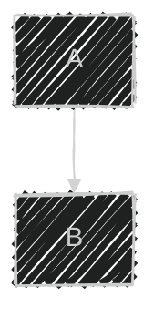

# Mermaid.js — Full Capabilities & Visual Editor Build Plan

> **Purpose:** Deep-dive into every Mermaid.js diagram type and feature.
> For each type, this document covers: what the diagram is, all its syntax options,
> and what visual editor UI/UX would be needed to build it.
>
> **Scope:** Research only. No implementation decisions yet.

---

## How to Read This Document

Each section covers one Mermaid diagram type with:
- **What it is** — purpose and target user
- **Full syntax breakdown** — every supported feature with code examples
- **Editor implications** — what React Flow nodes/edges/interactions we'd need

---

## 1. Flowchart (`flowchart` / `graph`)

### What it is
The most general-purpose diagram. Models processes, algorithms, decision trees, systems, and data flows. Maps directly to React Flow's node-edge model.

### Current MVP coverage: ~15%
(Only 4 of 30+ shapes, 1 of 12+ edge types, no subgraphs, no styling)

---

### 1.1 All Graph Directions

```mermaid
flowchart TD   %% Top → Down (default)
flowchart LR   %% Left → Right
flowchart BT   %% Bottom → Top
flowchart RL   %% Right → Left
```

**Editor UI needed:** Direction toggle (4 buttons) in toolbar. Triggers re-layout.

---

### 1.2 Complete Node Shape Reference

#### Basic Shapes (already in MVP)
```
A[Rectangle]           → square-cornered box
B(Rounded rectangle)   → rounded-corner box
C((Circle))            → circular node
D{Diamond}             → decision / lozenge
```

#### Extended Shapes (missing from MVP)
```
E([Stadium / Pill])         → rounded pill shape (terminal nodes)
F[[Subroutine]]             → double-border rectangle (function calls)
G[(Database / Cylinder)]    → cylinder shape (databases, storage)
H>Asymmetric]               → right-pointing flag (process I/O)
I{{Hexagon}}                 → hexagonal shape (preparation steps)
J[/Parallelogram/]          → slanted box (input)
K[\Parallelogram alt\]      → reverse slant (output)
L[/Trapezoid\]              → trapezoid top (manual input)
M[\Trapezoid alt/]          → trapezoid bottom (manual output)
N(((Double circle)))        → concentric circles (stop state)
```

#### Mermaid v11 Named Shape Syntax (30+ shapes)
```
A@{ shape: rect }           → standard rectangle
A@{ shape: rounded }        → rounded rectangle
A@{ shape: circle }         → circle
A@{ shape: diamond }        → diamond
A@{ shape: hexagon }        → hexagon
A@{ shape: stadium }        → stadium/pill
A@{ shape: subroutine }     → subroutine (double border)
A@{ shape: cylinder }       → cylinder (database)
A@{ shape: doublecircle }   → double circle
A@{ shape: trapezoid }      → trapezoid (top wider)
A@{ shape: inv-trapezoid }  → inverted trapezoid (bottom wider)
A@{ shape: lean-right }     → right-leaning parallelogram (input)
A@{ shape: lean-left }      → left-leaning parallelogram (output)
A@{ shape: delay }          → half-rectangle (delay/queue)
A@{ shape: lin-cyl }        → linear cylinder (tape storage)
A@{ shape: notch-rect }     → notched rectangle (card)
A@{ shape: hourglass }      → hourglass (converge)
A@{ shape: tag-rect }       → rectangle with right tag
A@{ shape: tag-doc }        → document with right tag
A@{ shape: bow-rect }       → bow-tie rectangle
A@{ shape: flip-tri }       → inverted triangle (document I/O)
A@{ shape: triangle }       → triangle (extract)
A@{ shape: fork }           → fork symbol
A@{ shape: junction }       → small junction circle
A@{ shape: start }          → filled circle (start terminal)
A@{ shape: end }            → filled circle in ring (end terminal)
A@{ shape: framed-circle }  → circle with outer frame
A@{ shape: cross-circ }     → circle with cross
A@{ shape: small-circ }     → tiny circle (junction)
```

#### Special Shapes
```
%% Icon node (requires font icon library loaded)
A@{ shape: icon, icon: "fa:user", label: "User" }

%% Image node (displays image inside node)
B@{ shape: image, imageHref: "https://...", label: "Logo" }
```

**Editor UI needed:**
- Shape picker panel (categorized: Basic, Process, Decision, I/O, Storage, Terminal, Special)
- Search/filter shapes by name
- Shape preview thumbnails
- Icon browser (if icon nodes supported)
- Image upload / URL input (if image nodes supported)

---

### 1.3 Complete Edge / Link Reference

#### Line Styles
```
A --> B        → solid line + filled arrowhead
A --- B        → solid line, no arrowhead
A -.-> B       → dotted/dashed line + arrowhead
A -.- B        → dotted/dashed line, no arrowhead
A ==> B        → thick/bold line + arrowhead
A === B        → thick/bold line, no arrowhead
A ~~~ B        → invisible link (layout-only, not rendered)
```

#### Arrowhead End Styles
```
A --> B        → standard arrowhead (→)
A --o B        → circle end (○)
A --x B        → cross end (×)
A <--> B       → bidirectional arrowhead (↔)
A o--o B       → circle on both ends
A x--x B       → cross on both ends
A <--> B       → standard bidirectional
```

#### Label Syntax
```
A -- "label text" --> B      → label on edge
A -->|"label text"| B        → alternative label syntax
A -- label --> B             → unquoted label (no spaces)
```

#### Edge Length (rank span)
```
A --> B        → standard length (1 rank)
A ---> B       → longer edge (2 ranks)
A ----> B      → even longer (3 ranks)
A -.-> B       → dotted standard
A -..-> B      → dotted longer
A ===> B       → thick longer
```

#### Edge IDs (Mermaid v11)
```
A --> B
    %% or with ID:
A ID@--> B
    %% Then style by ID:
style ID@ stroke:#f00
```

**Editor UI needed:**
- Edge style picker (right-click or properties panel):
  - Line type: solid / dashed / thick / invisible
  - Arrowhead: none / single / bidirectional / circle / cross
  - Length: standard / long / longer
- Edge color + width
- Edge label inline editing (already in MVP)

---

### 1.4 Edge Curve Styles

```mermaid
%%{ init: { "flowchart": { "curve": "basis" } } }%%
```

Available values:
| Curve | Visual Effect |
|-------|--------------|
| `basis` | Smooth S-curves through control points |
| `bumpX` | Horizontal bump |
| `bumpY` | Vertical bump |
| `cardinal` | Smooth spline |
| `catmullRom` | Smooth spline through points |
| `linear` | Straight segments |
| `monotoneX` | Monotone horizontal |
| `monotoneY` | Monotone vertical |
| `natural` | Natural cubic spline |
| `step` | Right-angle step (vertical first) |
| `stepAfter` | Right-angle step (horizontal first) |
| `stepBefore` | Step before midpoint |

**Editor UI needed:** Diagram-level curve style dropdown (defaults to basis/bezier).

---

### 1.5 Subgraphs / Groups


**Capabilities:**
- Named subgraphs with text labels and explicit IDs
- Edges **to and from subgraphs** (not just internal nodes)
- Each subgraph can have its **own direction**
- Subgraphs can be **nested** within each other
- Subgraph **styling** via `style subgraphId ...`

**Editor UI needed:**
- "Group selected nodes" action → wraps in container
- Container node (parent node in React Flow with `parentId`)
- Subgraph title editing
- Subgraph-level direction override
- Drag-in / drag-out of containers
- Expand/collapse container
- Edge attachment to container border

---

### 1.6 Node & Edge Styling

#### Inline node style
```
style nodeId fill:#ff9900,stroke:#cc6600,stroke-width:3px,color:#fff,font-size:14px
```

Supported CSS properties:
- `fill` — background color
- `stroke` — border color
- `stroke-width` — border thickness
- `color` — text color
- `font-size` — text size
- `font-family` — text font
- `rx`, `ry` — border radius
- `opacity` — transparency

#### Reusable class definitions
```
classDef primary fill:#4a90e2,stroke:#2c5282,color:#fff,font-weight:bold
classDef danger fill:#fc8181,stroke:#c53030,color:#fff
classDef success fill:#68d391,stroke:#276749
class node1,node2 primary
class node3 danger
```

#### Edge styling by index
```
linkStyle 0 stroke:#ff3,stroke-width:4px
linkStyle 1,2 stroke:#666,stroke-dasharray:5
linkStyle default stroke:#999        %% applies to all unset edges
```

**Editor UI needed:**
- Node properties panel (right sidebar or popover on select):
  - Fill color picker
  - Stroke color + width
  - Text color + size
- Edge properties panel:
  - Stroke color + width
  - Stroke style (solid/dashed)
- "Apply to all similar" option
- Class preset manager (save/load named styles)

---

### 1.7 Layout Engines

#### Dagre (default)
```mermaid
%%{ init: { "layout": "dagre" } }%%
flowchart TD
```

Configuration options:
- `rankdir`: TB / LR / BT / RL
- `ranksep`: vertical spacing between ranks
- `nodesep`: horizontal spacing between nodes
- `edgesep`: spacing between parallel edges
- `marginx` / `marginy`: canvas margin

#### ELK (Eclipse Layout Kernel)
```mermaid
%%{ init: { "layout": "elk" } }%%
flowchart TD
  elk:
    nodePlacementStrategy: LINEAR_SEGMENTS
    mergeEdges: true
```

ELK strategies:
- `SIMPLE` — fast, basic placement
- `INTERACTIVE` — preserves relative positions
- `LINEAR_SEGMENTS` — linear placement segments
- `BRANDES_KOEPF` — Brandes-Köpf algorithm
- `NETWORK_SIMPLEX` — network simplex method
- `BARYCENTRICALIGN` — barycentric alignment

ELK additional options:
- `mergeEdges: true/false` — combine parallel edges
- `hierarchyHandling: INCLUDE_CHILDREN` — hierarchical layout
- `elk.direction: DOWN/UP/RIGHT/LEFT`

**Editor UI needed:**
- Layout engine toggle: Dagre / ELK
- Layout direction: TD / LR / BT / RL
- Spacing sliders (node gap, rank gap)
- ELK strategy dropdown (when ELK selected)
- "Re-apply layout" button (already exists as "Auto Layout")

---

### 1.8 Markdown String Labels


Backtick string with markdown:
- `**bold**` — bold text
- `*italic*` — italic text
- Auto line-wrap (no `<br>` needed)
- Inline links (href) supported

**Editor UI needed:**
- Rich text / markdown toggle in label editor
- Formatting toolbar (B / I) when markdown mode on

---

### 1.9 Interactive / Clickable Nodes


Types:
- `click nodeId callbackFn "tooltip"` — triggers JS callback
- `click nodeId href "url" "tooltip" _blank` — opens URL in new tab

**Requires:** `securityLevel: 'loose'` in mermaid config

**Editor UI needed:**
- Node property: "On click" → None / Callback / URL
- URL input field
- Tooltip text input
- Toggle security level in settings

---

### 1.10 Themes & Visual Looks



#### Built-in themes
| Theme | Description |
|-------|-------------|
| `default` | Light background, blue accents |
| `dark` | Dark background, light elements |
| `forest` | Green palette |
| `neutral` | Grayscale, print-friendly |
| `base` | Minimal, for full customization |

#### Custom theme variables (with `base` theme)
```javascript
themeVariables: {
  primaryColor: "#4a90e2",
  primaryTextColor: "#1a202c",
  primaryBorderColor: "#2c5282",
  lineColor: "#718096",
  secondaryColor: "#e2e8f0",
  tertiaryColor: "#f7fafc",
  background: "#ffffff",
  mainBkg: "#ffffff",
  nodeBorder: "#cccccc",
  clusterBkg: "#f0f4f8",
  titleColor: "#1a202c",
  edgeLabelBackground: "#ffffff",
  fontSize: "16px"
}
```

#### Look options
- `classic` — standard rendering
- `handDrawn` — uses Rough.js for sketchy aesthetic

**Editor UI needed:**
- Theme picker dropdown (5 built-in + custom)
- Hand-drawn toggle
- Custom color palette (primary, secondary, line, text)

---

## 2. Sequence Diagram (`sequenceDiagram`)

### What it is
Shows interactions between actors/systems over time. Essential for API documentation, system design, and UML behavioral modeling.

### Full Feature Set

#### Participants & Actors


- `participant` — box shape (system component)
- `actor` — stick figure shape (human user)
- Custom aliases with `as` keyword
- Participants rendered in order of declaration
- Reorder by explicit declaration order

#### Message Arrow Types
```
User ->> Server: solid line with open arrowhead (sync call)
Server -->> User: dashed line with open arrowhead (response)
User -> Server: solid thin line no arrowhead
Server --> User: dashed thin line no arrowhead
User -x Server: solid with X at target (destroyed)
Server -) User: solid with open async arrow
Server --) User: dashed with open async arrow
```

#### Activations (lifeline boxes)
```
User ->> Server: request
activate Server
Server -->> User: response
deactivate Server

%% Shorthand:
User ->>+ Server: request
Server -->>- User: response
```

#### Notes
```
Note left of Alice: Note on left side
Note right of Bob: Note on right side
Note over Alice,Bob: Note spanning both participants
```

#### Control Flow Blocks
```
loop Every minute
  Server ->> DB: poll for updates
end

alt Logged in
  User ->> Server: POST /data
else Not logged in
  User ->> Auth: GET /login
end

opt Optional step
  Server ->> Email: notify
end

par Parallel execution
  Server ->> Cache: warm cache
and
  Server ->> Logger: log event
end

critical Must succeed
  Server ->> DB: write data
  option Timeout
    Server ->> Queue: retry
end

break On error
  Server ->> Logger: log error
end
```

#### Background Rect Highlights
```
rect rgb(191, 223, 255)
  Server ->> DB: highlighted interaction
end
```

#### Autonumbering
```
sequenceDiagram
  autonumber
  Alice ->> Bob: first message
  Bob -->> Alice: second message
```

#### Create & Destroy Participants
```
create participant Temp
Alice ->> Temp: create
destroy Temp
Temp -->> Alice: done
```

#### Group actors with Box
```
box Blue Frontend
  actor User
  participant Browser
end
box Green Backend
  participant API
  participant DB
end
```

#### Clickable Participants
```
link Alice: Dashboard @ https://dashboard.example.com
links Alice: {"Docs": "https://docs.example.com", "GitHub": "https://github.com/..."}
```

### Editor implications for Sequence Diagrams

**Node types needed:**
- Participant node (box with lifeline)
- Actor node (stick figure with lifeline)
- Activation box (overlay on lifeline)
- Note block (floating annotation)
- Group box (colored container for participants)

**Edge types needed:**
- Solid arrow (sync call)
- Dashed arrow (response/async)
- Solid+X (destroy signal)
- Async (open arrow)

**Block regions needed:**
- Loop block (with condition label)
- Alt/Else block (multi-branch)
- Opt block
- Par block (with `and` divider)
- Critical/Break block
- Background rect (color highlight)

**Layout logic:** Sequence diagrams have a fixed vertical timeline layout — participants are columns, messages flow top-to-bottom. This requires a custom layout engine (not Dagre), likely a dedicated column-based renderer.

**Serialization challenge:** Medium. The AST for sequence diagrams is more complex than flowcharts due to nested blocks.

---

## 3. Class Diagram (`classDiagram`)

### What it is
UML class diagram. Visualizes object-oriented structure — classes, attributes, methods, and their relationships. Used in software architecture, API design, and data modeling.

### Full Feature Set

#### Class Definition


**Visibility modifiers:**
| Symbol | Visibility |
|--------|----------|
| `+` | Public |
| `-` | Private |
| `#` | Protected |
| `~` | Package (default) |

**Attribute modifiers:**
| Suffix | Meaning |
|--------|---------|
| `$` | Static |
| `*` | Abstract |

#### Generics / Templates
```
class Container~T~ {
  +List~T~ items
  +add(item T) void
  +get() T
}
```

#### Relationship Types (8)
```
Animal <|-- Dog          : Inheritance (extends)
Car *-- Engine           : Composition (has-a, strong)
Pond o-- Duck            : Aggregation (has-a, weak)
Teacher --> Student      : Association (uses)
A -- B                   : Link (bidirectional)
Dependency ..> Interface : Dependency (uses temporarily)
Class ..|> Interface     : Realization (implements)
A ..) B                  : Dashed link
```

#### Multiplicity
```
School "1" *-- "many" Student
Company "1" o-- "0..*" Employee
```

#### Labels on relationships
```
Animal --> Food : eats
Student -- Teacher : taught by
```

#### Notes
```
note for Animal "This is the base class"
note "Global note"
```

#### Namespaces
```
namespace Backend {
  class UserService {
    +getUser(id) User
  }
  class UserRepository {
    +findById(id) User
  }
}
```

#### Annotations
```
class MyInterface {
  <<interface>>
  +method() void
}
class MyEnum {
  <<enumeration>>
  VALUE_ONE
  VALUE_TWO
}
class MyAbstract {
  <<abstract>>
  +doSomething()* void
}
class MyService {
  <<service>>
  +process() void
}
```

#### Direction
```
classDiagram
  direction LR
```

### Editor implications for Class Diagrams

**Node type needed:** Class node with:
- Class name header
- Attributes section (list of typed fields)
- Methods section (list of typed functions)
- Annotation badge (interface/enum/abstract/service)
- Namespace grouping container

**Edge types needed:** 8 distinct relationship types each with unique arrowhead styles (inheritance triangle, composition filled diamond, aggregation hollow diamond, etc.)

**Add/Edit panel:** Dedicated UI for adding attributes and methods with type/visibility pickers.

---

## 4. Entity Relationship Diagram (`erDiagram`)

### What it is
Database schema diagram. Shows tables (entities), their columns (attributes), and relationships with cardinality. Used by database architects, backend developers.

### Full Feature Set

#### Entity with Attributes


**Attribute types:** `int`, `string`, `boolean`, `date`, `float`, `decimal`, `datetime`, `json`, `text`, `uuid`

**Key constraints:** `PK` (Primary Key), `FK` (Foreign Key), `UK` (Unique Key)

#### Relationship Syntax (Crow's Foot Notation)
```
CUSTOMER ||--o{ ORDER : "places"
ORDER ||--|{ LINE_ITEM : "contains"
PRODUCT |o--o{ LINE_ITEM : "included in"
```

**Cardinality symbols:**
| Symbol | Meaning |
|--------|---------|
| `\|o` or `o\|` | Zero or one |
| `\|\|` | Exactly one |
| `o{` or `}o` | Zero or many |
| `\|{` or `}\|` | One or many |

**Relationship type:**
- `--` solid line = identifying (child depends on parent for PK)
- `..` dashed line = non-identifying

#### Relationship label
```
ENTITY_A CARDINALITY -- CARDINALITY ENTITY_B : "label text"
```

### Editor implications for ER Diagrams

**Node type needed:** Entity node (table) with:
- Entity name header
- Attribute rows (type + name + key + comment)
- Add/remove attribute buttons
- Key type badges (PK/FK/UK)

**Edge types needed:** Crow's foot notation SVG custom edges (6 combinations of cardinality)

**Add entity panel:** Type selector, name, add attributes wizard

---

## 5. State Diagram (`stateDiagram-v2`)

### What it is
Finite state machine visualization. Shows states, transitions, and conditions. Used for protocol design, UI state modeling, and embedded system design.

### Full Feature Set

#### Basic States & Transitions


`[*]` = start/end terminal (context-dependent)

#### Composite / Nested States
```
state Running {
  [*] --> Fetching
  Fetching --> Processing
  Processing --> [*]
}
```

#### Concurrent Regions (Parallel States)
```
state Active {
  [*] --> Audio
  --
  [*] --> Video
}
```
`--` divides the state into concurrent regions.

#### Fork / Join
```
state fork_state <<fork>>
state join_state <<join>>

[*] --> fork_state
fork_state --> StateA
fork_state --> StateB
StateA --> join_state
StateB --> join_state
join_state --> [*]
```

#### Choice (Condition)
```
state choice <<choice>>
StateA --> choice
choice --> StateB : if condition
choice --> StateC : else
```

#### Notes
```
note right of Running : This state handles processing
note left of Idle
  Multi-line note
  goes here
end note
```

#### Transitions with Labels
```
Idle --> Active : user.login()
Active --> Idle : user.logout()
```

#### Direction
```
stateDiagram-v2
  direction LR
```

### Editor implications for State Diagrams

**Node types needed:**
- State node (rounded rectangle)
- Composite state node (container)
- Start terminal (`[*]` filled circle)
- End terminal (`[*]` circle-in-circle)
- Fork node (thin horizontal bar)
- Join node (thin horizontal bar)
- Choice node (diamond)

**Edge types:** Labeled transition arrows

**Layout:** State diagrams can use Dagre with TB/LR, but nested states need parent-child grouping.

---

## 6. Gantt Chart (`gantt`)

### What it is
Project schedule visualization. Shows tasks, durations, dependencies, and milestones on a timeline. Used by project managers, engineering managers.

### Full Feature Set

#### Full Syntax


#### Task Tags
| Tag | Visual |
|-----|--------|
| `done` | Green fill (completed) |
| `active` | Blue fill (in progress) |
| `crit` | Red fill (critical path) |
| `milestone` | Diamond marker (zero-duration) |
| `vert` | Vertical dashed line at date |

#### Date/Time Configuration
- `dateFormat` — input date format (YYYY-MM-DD, DD.MM.YYYY, etc.)
- `axisFormat` — tick label format (d3-time-format codes)
- `tickInterval` — `1day`, `1week`, `1month`
- `weekday monday/sunday` — which day starts the week

#### Dependencies
```
taskA : id1, 2024-01-01, 7d
taskB : id2, after id1, 5d           → starts after id1 ends
taskC : id3, after id1 id2, 3d       → starts after BOTH end
```

#### Exclusions
```
excludes weekends
excludes 2024-12-25, 2024-12-26
excludes weekends, 2024-12-25
```

#### Sections
Groups tasks visually with a label bar.

### Editor implications for Gantt Charts

**This is primarily a code-driven diagram** — the visual editor would be less of a drag-and-drop canvas and more of a structured form/table:
- Date range pickers per task
- Drag task bars to resize duration
- Drag to reorder within sections
- Dependency picker (select from existing task IDs)
- Section management (add/rename/delete)
- Tag toggle (done/active/crit/milestone)
- Date format and axis config panel

---

## 7. Mindmap (`mindmap`)

### What it is
Hierarchical idea visualization. Shows a central topic with branching subtopics. Used for brainstorming, note-taking, planning.

### Full Feature Set

#### Syntax (indent-based)


#### Node Shapes
| Syntax | Shape |
|--------|-------|
| `((text))` | Circle |
| `(text)` | Rounded rectangle |
| `[text]` | Square |
| `))text((` | Bang (explosion shape) |
| `)text(` | Cloud |
| `{{text}}` | Hexagon |

#### Icons
```
::icon(fa fa-user)       → FontAwesome icon
::icon(mdi:account)      → Material Design Icon
```

#### Markdown text
```
**Bold text**
*Italic text*
Auto-wrapping text
```

#### Depth-based styling
Each depth level automatically gets a distinct color following the theme.

### Editor implications for Mindmaps

**Layout paradigm shift:** Mindmaps are **radial / tree layouts**, not the DAG of flowcharts. React Flow needs a radial/tree layout algorithm (D3-tree, Reingold-Tilford).

**Node types needed:**
- Root node (circle, special prominence)
- Topic node (6 shape variants)
- Icon-enabled node

**Interaction model:**
- Tab/Enter to add child node (tree building keyboard UX)
- Drag to reorder siblings
- Collapse/expand branches
- Click to add sibling vs. child

---

## 8. Git Graph (`gitgraph`)

### What it is
Visualizes a Git commit history with branches, merges, and tags. Primarily useful for documentation — explaining branching strategies, release flows, hotfixes.

### Full Feature Set

#### Basic Operations
```mermaid
gitgraph LR:
  commit id: "Initial commit"
  commit id: "Add README"

  branch feature/auth
  checkout feature/auth
  commit id: "Add login"
  commit id: "Add logout"

  checkout main
  merge feature/auth id: "Merge auth" tag: "v1.0"

  branch hotfix
  checkout hotfix
  commit id: "Fix critical bug" type: REVERSE

  checkout main
  merge hotfix id: "Hotfix merge" tag: "v1.0.1"

  cherry-pick id: "Fix critical bug"
```

#### Commit Types
| Type | Visual |
|------|--------|
| `NORMAL` (default) | Standard dot |
| `HIGHLIGHT` | Highlighted dot (different color) |
| `REVERSE` | Reverse operation dot |

#### Orientation
- `gitgraph LR:` — left-to-right (time flows right)
- `gitgraph TB:` — top-to-bottom

#### Cherry-pick
```
cherry-pick id: "commitId" parent: "parentId"
```

### Editor implications for Git Graph

**Highly structured diagram** — not free-form. The editor would be:
- Branch manager (create, name, checkout)
- Commit button (adds to current branch)
- Merge dialog (select target branch, add ID + tag)
- Cherry-pick picker (select commit ID)
- Orientation toggle (LR / TB)

---

## 9. User Journey (`journey`)

### What it is
Maps a user's experience through a process, with satisfaction scores per step and multiple actors. Used by UX designers and product managers.

### Full Feature Set


#### Elements
- `title` — diagram title
- `section` — phase grouping
- `task: score: actor1, actor2` — step with satisfaction and actors
- Scores: 1 (terrible) → 5 (great)
- Multiple actors per step
- Auto-colored swimlanes per actor

### Editor implications

**Structured form-based editor:**
- Section manager (add/rename/delete/reorder)
- Step editor (name + score slider + actor checkboxes)
- Actor manager (add/rename/remove actors)
- Preview shows colored swimlane visualization

---

## 10. Timeline (`timeline`)

### What it is
Simple chronological event visualization. Good for product roadmaps, company history, release history.

### Full Feature Set


#### Elements
- `title` — diagram title
- `section name` — color-coded era groupings
- `period : event` — time period with one or more events
- Multiple events per period (repeat colon line)

### Editor implications

**List-based editor:**
- Section manager
- Period + events form
- Drag to reorder periods
- Inline editing of event text

---

## 11. Block Diagram (`block-beta`)

### What it is
Shows system components arranged in a grid. Good for architecture overviews, technical specifications.

### Full Feature Set


#### Elements
- `columns N` — set grid column count
- `BlockName["Label"]:N` — block spanning N columns
- `space` — empty grid cell
- `block ... end` — composite block (group)
- `columns 1` inside composite block — single column group

#### Connection Types
```
A --> B         → arrow
A --- B         → line no arrow
A -- "label" --> B   → labeled arrow
A & B --> C     → multiple sources to one target
```

### Editor implications

**Grid-based layout editor:**
- Column count slider
- Block span control (resize by column span)
- Drag to reorder blocks in grid
- Composite block nesting

---

## 12. C4 Architecture Diagrams

### What it is
Software architecture documentation using the C4 model (Context → Container → Component → Code). Used by solution architects, system designers.

### Five Diagram Levels


#### Element Types

| Type | Shape | Usage |
|------|-------|-------|
| `Person` | Person icon | Internal user |
| `Person_Ext` | Person icon (gray) | External user |
| `System` | Box | Internal system |
| `System_Ext` | Box (gray) | External system |
| `SystemDb` | Cylinder | Database |
| `SystemQueue` | Queue shape | Message queue |
| `Container` | Box | App/service/DB |
| `Container_Ext` | Box (gray) | External container |
| `ContainerDb` | Cylinder | Container database |
| `ContainerQueue` | Queue | Container queue |
| `Component` | Box | Code component |
| `Component_Ext` | Box (gray) | External component |

#### Boundary Types
```
Enterprise_Boundary(eb, "Enterprise") {
  System(s1, "System 1")
}
System_Boundary(sb, "System") {
  Container(c1, "Container")
}
Container_Boundary(cb, "Container") {
  Component(comp1, "Component")
}
```

#### Relationships
```
Rel(from, to, "label")
Rel(from, to, "label", "technology/protocol")
Rel_Back(from, to, "label")           → reverse arrow direction
Rel_Neighbor(from, to, "label")       → same-rank positioning hint
Rel_Up/Down/Left/Right(from, to, "label")   → directional hints
BiRel(from, to, "label")              → bidirectional
```

### Editor implications

**Rich contextual editor:**
- C4 level switcher (Context/Container/Component)
- Element type picker (Person/System/Container/Component + Ext variants)
- Technology/protocol field on relationships
- Boundary drawing tool (drag to create scope container)
- Automatic styling per C4 element type (built-in visual conventions)

---

## 13. Quadrant Chart (`quadrantChart`)

### What it is
2D scatter plot with labeled quadrants. Used for priority matrices, technology radar, SWOT analysis.

### Full Feature Set


#### Elements
- `title` — chart title
- `x-axis label1 --> label2` — x-axis min/max labels
- `y-axis label1 --> label2` — y-axis min/max labels
- `quadrant-N "label"` — label for each quadrant (1=top-right, 2=top-left, 3=bottom-left, 4=bottom-right)
- `Point Name: [x, y]` — data point at coordinates (0-1 range)

#### Point Styling
```
classDef custom fill:#ff0,color:#000,stroke:#f00
class "Point Name" custom
```

### Editor implications

**Lightweight editor:**
- Click on quadrant canvas to place a point
- Drag points to reposition
- Click point to rename
- Axis label editors
- Quadrant label editors

---

## 14. Pie Chart (`pie`)

### What it is
Proportional data distribution. Simple, universally understood.

### Full Feature Set

```mermaid
pie showData
  title Development Time Distribution
  "Backend" : 35
  "Frontend" : 30
  "Testing" : 20
  "DevOps" : 10
  "Documentation" : 5
```

#### Options
- `showData` — display raw values alongside %
- `title` — chart title
- Slices rendered clockwise in code order
- Values auto-normalized to percentages

### Editor implications

**Simple form:**
- Add/remove/rename slices
- Numeric value input per slice
- Color override per slice
- Title field

---

## 15. XY Chart (`xychart-beta`)

### What it is
Bar charts and line charts with configurable axes. Useful for data visualization in docs.

### Full Feature Set

```mermaid
xychart-beta
  title "Monthly Revenue 2024"
  x-axis ["Jan", "Feb", "Mar", "Apr", "May", "Jun"]
  y-axis "Revenue ($K)" 0 --> 150
  bar [45, 62, 58, 71, 89, 95]
  line [40, 55, 60, 68, 82, 91]
```

```mermaid
xychart-beta horizontal
  title "Department Headcount"
  x-axis 0 --> 100
  y-axis ["Eng", "Product", "Design", "Sales", "Support"]
  bar [75, 20, 15, 40, 30]
```

#### Elements
- `title` — chart title
- `x-axis [categories]` — categorical x axis
- `x-axis min --> max` — numeric x axis
- `y-axis "label" min --> max` — numeric y with label
- `bar [values]` — bar series
- `line [values]` — line series
- `horizontal` — flip orientation

### Editor implications

**Spreadsheet-like editor:**
- Category/axis label inputs
- Min/max range sliders
- Series manager (add bar/line series)
- Data table (rows = categories, columns = series)
- Chart type toggle per series (bar/line)
- Horizontal toggle

---

## 16. Sankey Diagram (`sankey-beta`)

### What it is
Flow visualization where link widths are proportional to quantity. Good for energy flows, budget allocation, user journey funnels.

### Full Feature Set

```mermaid
sankey-beta
  %% source,target,value
  Revenue,Product Sales,500
  Revenue,Services,300
  Revenue,Licensing,200
  Product Sales,COGS,200
  Product Sales,Gross Profit,300
  Services,COGS,100
  Services,Gross Profit,200
  Licensing,Gross Profit,200
  Gross Profit,Operating Expenses,300
  Gross Profit,EBITDA,400
```

#### Configuration
```javascript
%%{
  init: {
    "sankey": {
      "linkColor": "source",    // "source" | "target" | "gradient" | "#hex"
      "nodeAlignment": "justify" // "justify" | "center" | "left" | "right"
    }
  }
}%%
```

### Editor implications

**Flow/value editor:**
- Add source → target flow (with value)
- Node list auto-populated from flows
- Value input per flow
- Link color mode toggle
- Alignment selector

---

## 17. Kanban (`kanban`)

### What it is
Workflow board with columns and cards. Visualizes work in progress across stages.

### Full Feature Set

```mermaid
kanban
  Todo
    task1["Fix login bug"]@{ ticket: "BUG-001", priority: "High" }
    task2["Update docs"]@{ ticket: "DOC-002" }
  InProgress
    task3["Build dashboard"]@{ ticket: "FEA-010", assigned: "Alice", priority: "High" }::active
  Review
    task4["Code review PR#45"]@{ ticket: "REV-003", assigned: "Bob" }
  Done
    task5["Deploy v1.2"]@{ ticket: "OPS-008" }::done
```

#### Metadata (`@{ }`)
- `ticket: "ID"` — ticket/issue ID
- `priority: "High|Medium|Low"` — priority level
- `assigned: "Name"` — assignee name
- `link: "url"` — external link

#### Global config
```javascript
%%{ init: { "kanban": { "ticketBaseUrl": "https://jira.example.com/browse/" } } }%%
```

### Editor implications

**Board-style UI:**
- Columns can be added/renamed/deleted/reordered
- Cards can be dragged between columns
- Card metadata form (ticket, priority, assignee)
- Status badge picker (active/done)

---

## 18. Requirement Diagram (`requirementDiagram`)

### What it is
SysML-based requirements traceability. Used in regulated industries (aerospace, medical, automotive) for compliance documentation.

### Full Feature Set

```mermaid
requirementDiagram
  requirement auth_req {
    id: REQ-001
    text: The system shall authenticate users via OAuth 2.0
    risk: high
    verifymethod: test
  }

  functionalRequirement ui_req {
    id: REQ-002
    text: The UI shall load in under 2 seconds
    risk: medium
    verifymethod: demonstration
  }

  performanceRequirement perf_req {
    id: REQ-003
    text: The system shall support 1000 concurrent users
    risk: high
    verifymethod: analysis
  }

  element auth_module {
    type: software
    docref: auth-spec-v2.pdf
  }

  element ui_component {
    type: software
    docref: ui-spec.pdf
  }

  auth_module - satisfies -> auth_req
  ui_component - satisfies -> ui_req
  ui_component - traces -> perf_req
  auth_req - refines -> ui_req
```

#### Requirement Types
- `requirement` — generic
- `functionalRequirement` — functional behavior
- `performanceRequirement` — performance specs
- `interfaceRequirement` — interfaces
- `physicalRequirement` — physical constraints
- `designConstraint` — design restrictions

#### Risk Levels
`low` · `medium` · `high`

#### Verification Methods
`analysis` · `demonstration` · `inspection` · `test`

#### Relationship Types
- `satisfies` — element fulfills requirement
- `traces` — traceability link
- `refines` — requirement refines another
- `contains` — requirement contains another
- `copies` — requirement copies another
- `derives` — requirement derived from another
- `verifies` — element verifies requirement

### Editor implications

**Form-heavy editor:**
- Requirement type selector
- Requirement fields form (ID, text, risk, verify)
- Element definition (type, docref)
- Relationship picker (from → type → to)

---

## Summary: Editor Build Order (Mermaid-Capability-First)

### Phase 1: Flowchart Completeness
Bring the existing flowchart editor to 100% Mermaid coverage:

1. All 30+ node shapes
2. All 12+ edge types (styles + arrowheads)
3. All 12 curve styles
4. All 4 directions (TD/LR/BT/RL)
5. Subgraphs / groups
6. Node and edge styling (color, stroke, font)
7. All 5 themes + hand-drawn look
8. Dagre + ELK layout options
9. Markdown labels
10. Clickable nodes / tooltip
11. Import Mermaid → canvas (flowchart parser)
12. Undo / redo
13. Copy / paste / duplicate

### Phase 2: Data Visualization Diagrams
Simple to build because they are primarily code-generated, no complex canvas interaction:

1. Timeline (low complexity)
2. Pie Chart (low)
3. Quadrant Chart (low)
4. Gantt Chart (medium — date-aware)
5. XY Chart (medium)
6. Sankey Diagram (medium)

### Phase 3: Tree / Hierarchy Diagrams

1. Mindmap (medium — radial layout)
2. Git Graph (medium — branch-tracking layout)
3. User Journey (medium — swimlane layout)
4. Kanban (medium — column layout)
5. Block Diagram (medium — grid layout)

### Phase 4: UML / Technical Diagrams
High complexity — new layout paradigms + complex node types:

1. State Diagram (high)
2. Class Diagram (high)
3. ER Diagram (high)
4. C4 Architecture (high)
5. Sequence Diagram (very high — timeline layout)
6. Requirement Diagram (high)

---

## Sources

- [Mermaid.js Syntax Reference](https://mermaid.js.org/intro/syntax-reference.html)
- [Mermaid Flowchart](https://mermaid.js.org/syntax/flowchart.html)
- [Mermaid Flowchart Shapes (v11)](https://mermaid.js.org/syntax/flowchart.html#expanded-node-shapes-in-mermaid-flowcharts-v11-3-0)
- [Mermaid Sequence Diagram](https://mermaid.js.org/syntax/sequenceDiagram.html)
- [Mermaid Class Diagram](https://mermaid.js.org/syntax/classDiagram.html)
- [Mermaid ER Diagram](https://mermaid.js.org/syntax/entityRelationshipDiagram.html)
- [Mermaid State Diagram](https://mermaid.js.org/syntax/stateDiagram.html)
- [Mermaid Gantt](https://mermaid.js.org/syntax/gantt.html)
- [Mermaid Mindmap](https://mermaid.js.org/syntax/mindmap.html)
- [Mermaid Git Graph](https://mermaid.js.org/syntax/gitgraph.html)
- [Mermaid User Journey](https://mermaid.js.org/syntax/userJourney.html)
- [Mermaid Timeline](https://mermaid.js.org/syntax/timeline.html)
- [Mermaid Block Diagram](https://mermaid.js.org/syntax/block.html)
- [Mermaid C4](https://mermaid.js.org/syntax/c4.html)
- [Mermaid Quadrant](https://mermaid.js.org/syntax/quadrantChart.html)
- [Mermaid Pie](https://mermaid.js.org/syntax/pie.html)
- [Mermaid XY Chart](https://mermaid.js.org/syntax/xychart.html)
- [Mermaid Sankey](https://mermaid.js.org/syntax/sankey.html)
- [Mermaid Kanban](https://mermaid.js.org/syntax/kanban.html)
- [Mermaid Requirement Diagram](https://mermaid.js.org/syntax/requirementDiagram.html)
- [Mermaid Theming](https://mermaid.js.org/config/theming.html)
- [DeepWiki: Mermaid Diagram Types](https://deepwiki.com/mermaid-js/mermaid/3-diagram-types)
